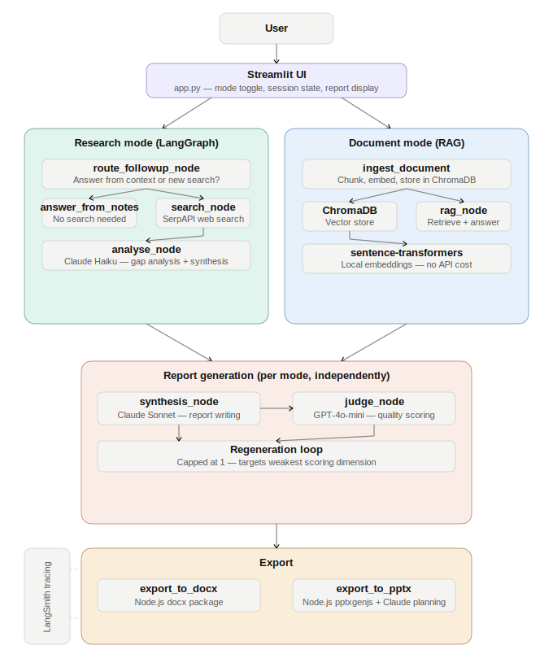

# Groundwork: Architecture and Design Decisions

This document explains the key architectural decisions behind Groundwork, including why each choice was made and what tradeoffs were considered. It is intended for anyone who wants to understand the system at a deeper level than the README provides.

---

## The core design principle

Every part of Groundwork was built around one question: does this component actually need the complexity I am about to add, or am I adding it because it sounds impressive?

That question shaped every decision in this document. LangGraph is used for exactly one part of the pipeline. Two separate LLM providers are used for genuinely different reasons. The export architecture is two-stage because one stage alone would not be reliable. None of these choices were made arbitrarily.

---

## Why two separate modes

Research mode and Document mode are fully independent at every level: separate session state, separate accumulated history, separate report generation, separate export. They share the same UI shell and the same backend agent functions, but their data never mixes.

The reason is groundedness. When a user uploads a document and asks a question, they expect the answer to come strictly from that document. If research findings from the open web were silently blended in, the answer might be more complete but it would no longer be trustworthy as a document-grounded response. The user could not tell which parts came from their file and which came from somewhere else.

Keeping the modes separate preserves a clear contract: research mode answers are web-sourced, document mode answers are file-sourced, and a report from either mode reflects only its own sources.

---

## Why LangGraph is used only for research

LangGraph is a framework for building stateful, looping agent pipelines. It is genuinely powerful, but it adds real complexity: explicit state schemas, node registration, conditional edge functions, and a compiled graph object that is harder to step through in a debugger than plain Python.

Groundwork uses LangGraph for exactly one thing: the autonomous research loop. This is the only part of the pipeline that genuinely needs it, because:

- It loops an unknown number of times (Claude decides when enough information has been gathered)
- It branches conditionally (search again, or move to synthesis)
- It runs without human input between iterations

Every other part of the pipeline (RAG retrieval, synthesis, judging, export) runs exactly once per user action, with no branching. Wrapping those in a graph would add structure with no benefit. They are plain function calls, which makes them easier to read, test, and debug.

This is a deliberate architectural boundary, not an oversight.

---

## The research pipeline in detail

When a user submits a research question, the following happens:

**1. Route followup node**
The graph first checks whether prior research context exists for this session. If it does, Claude reads the new question alongside all prior research notes and decides whether the question can be answered from what has already been found, or whether new web search is needed. This routing decision uses tool-based structured output to guarantee a clean binary result. If no prior context exists (first question of the session), it routes directly to search with no LLM call.

**2. Answer from notes node**
If the routing decision is "answer from context," Claude answers the follow-up directly from the accumulated prior notes. No web search runs, no new sources are added. This keeps the response fast and avoids redundant searches for summary or clarification questions.

**3. Search node**
If new search is needed, the search node calls SerpAPI with the current query. On the first pass, the query is the user's topic. On subsequent passes, it uses the refined query produced by Claude in the previous analysis step. Results are accumulated, not replaced, so each analysis step can see everything found so far.

**4. Analyse node**
Claude Haiku reviews all accumulated search results and makes a structured decision: is there a meaningful gap that one more search would fill, and if so what should the query be? If no more search is needed (or the hard cap of three searches is reached), it synthesises the results into structured research notes. The gap analysis uses function calling to guarantee the response always contains the required fields.

---

## Why Claude Haiku for research and Claude Sonnet for synthesis

Different tasks have different requirements.

The research loop runs multiple times per user question. The gap analysis and routing decisions are relatively simple: read some text, make a binary decision, optionally produce a short search query. Haiku is fast and inexpensive for this kind of task, and using a cheaper model here keeps the cost of the full pipeline reasonable.

Synthesis and PPTX slide planning produce the final deliverable. Quality matters much more here than speed or cost. Sonnet produces noticeably better structured writing and more coherent slide plans than Haiku, which justifies the higher cost for a one-time call per report.

---

## Why GPT-4o-mini judges the report

The synthesis agent uses Claude to write the report. If Claude also scored the report, it would be evaluating its own output. Models tend to rate their own output more favourably than an independent evaluator would, a pattern sometimes called self-grading bias.

Using GPT-4o-mini from OpenAI as the judge introduces genuine independence: different model, different training, different company. The judge scores four dimensions (accuracy, groundedness, helpfulness, conciseness) and produces per-dimension reasoning. LiteLLM provides a unified interface so the codebase treats the OpenAI call identically to the Anthropic calls, just with a different model string.

This is a pattern used in production AI evaluation systems and something a PM speccing an AI product should be able to call out explicitly when reviewing a system design.

---

## Tool-based structured output

Throughout Groundwork, any LLM call that drives a decision uses OpenAI-style function calling with an explicit schema, rather than asking the model to "respond in JSON" and parsing the result.

The difference matters in production. When you ask a model to respond in JSON and parse the result, you are relying on the model to format its response correctly every time. Sometimes it adds markdown fences. Sometimes it adds explanatory prose after the JSON block. Sometimes the structure is slightly off. Each of these cases requires a parsing fallback, and each fallback is a potential silent failure.

With tool-based structured output, the model is forced to call a named function with a schema-validated argument object. The response either conforms to the schema or it fails explicitly. There is no ambiguous middle ground.

This approach is used for gap analysis decisions in the research loop, routing decisions in the follow-up node, and quality scoring in the judge agent.

---

## The RAG pipeline

Document mode uses a standard but carefully implemented RAG pipeline.

When a file is uploaded, it is chunked into 300-token segments with 30-token overlap. The overlap matters: without it, a sentence that spans a chunk boundary would be split across two chunks, and retrieval might miss the full context. Each chunk is embedded using a local sentence-transformer model (all-MiniLM-L6-v2), which runs on the user's machine with no API call and no cost.

Embeddings are stored in ChromaDB. Each user session gets its own ChromaDB collection, which keeps documents from different sessions isolated. When the user asks a question, the question is embedded using the same model, and the three most semantically similar chunks are retrieved. Claude then answers only from those chunks, with an explicit instruction not to use outside knowledge.

The local embedding model is a deliberate choice. It is smaller and less capable than API-based embedding models from OpenAI or Anthropic, but it is free, fast, and requires no additional API key. For the kind of document retrieval Groundwork does (finding relevant passages in business documents, reports, and case studies), it performs well enough that the tradeoff is clearly worth it.

---

## The export architecture

Both the DOCX and PPTX exporters use a two-stage design.

In stage one, an LLM produces a structured plan. For PPTX, Claude Sonnet is given the report brief and asked to plan the full deck: how many slides, which layout to use for each, what content goes on each slide, what colour palette fits the topic. This plan is returned via function calling as a validated JSON object. For DOCX, the brief is parsed from markdown into a typed element list (title, heading, paragraph) by a simple deterministic parser, with no LLM call needed.

In stage two, Python generates a self-contained Node.js script that renders the file using npm packages (docx for Word, pptxgenjs for PowerPoint) and executes it via subprocess. Once the plan exists, no further LLM calls are made. Rendering is fully deterministic.

This separation matters for reliability. If the layout or formatting is wrong, the problem is in the Python script generation, not in the LLM prompt. It can be debugged and fixed in code. Trying to fix layout issues by iterating on the prompt is slower, less reliable, and much harder to test.

---

## Session state and multi-turn accumulation

Groundwork is a Streamlit app, which means every user interaction triggers a full re-execution of the Python script from top to bottom. There is no persistent server-side state between reruns.

Streamlit's session state dictionary solves this. Every accumulated question, research note, source, report, judge result, and export cache is stored in session state and persists for the lifetime of the browser session.

The research and document modes maintain completely separate state variables. There is no shared accumulation list. This was a deliberate correction made during development after an initial design that combined both modes into one list, which would have silently blended web-sourced and document-grounded material.

---

## LangSmith tracing

All LLM calls in the pipeline pass through a centralised `call_llm()` function in `tracing.py`. This function wraps the LiteLLM completion call and is the single place where LangSmith instrumentation is applied.

When `LANGCHAIN_TRACING_V2=true` is set in the environment, every call is logged to LangSmith with the full prompt, response, token counts, latency, and model name. This made it possible during development to inspect exactly what was being sent to each model at each step, which was particularly useful for debugging the gap analysis and routing decisions.

Tracing is optional and off by default. The app runs correctly without it.

---

## What was deliberately left out of v1

A few things were considered and consciously deferred.

**Context-aware search query rewriting.** When a follow-up question like "research specific to USA" follows prior research, the routing node correctly identifies that new search is needed. However, the first search query is still built from the raw follow-up text rather than a resolved, context-aware version. Fixing this properly requires an additional LLM call inside the search node to rewrite the query before it hits SerpAPI. It is designed and documented in the backlog but was not included in v1.

**Parallel conversation threads.** Each session has one research thread and one document thread. Supporting multiple named research threads would require persistent storage beyond Streamlit session state, a thread-switching UI, and more complex state management. The incremental value for most use cases did not justify the additional complexity at this stage.

**Chart generation in PPTX.** The slide planner can represent quantitative content as a stat callout layout (a large number with an explanatory label), but it cannot render actual charts or graphs. This requires a different rendering approach and is tracked in the backlog.
